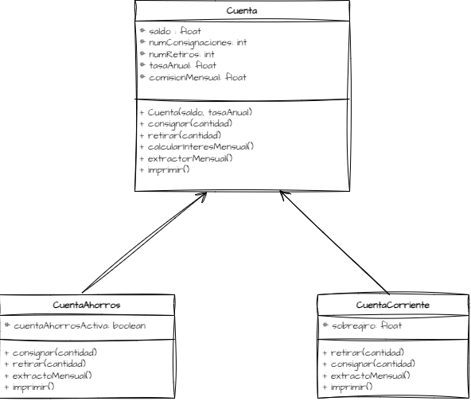
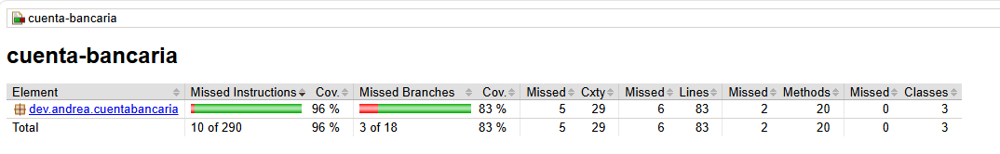
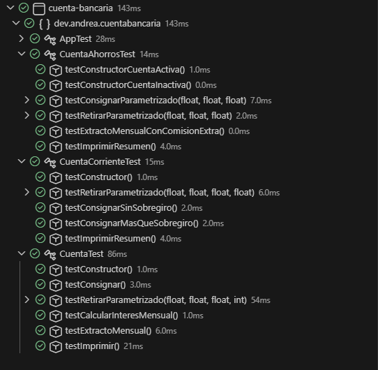

# Cuenta Bancaria

Modelado en Java de una jerarquía de cuentas bancarias usando herencia, encapsulación y tests unitarios parametrizados.

Repositorio: [AndreaVaGo/cuenta-bancaria](https://github.com/AndreaVaGo/cuenta-bancaria)

## Descripción

El proyecto modela una cuenta bancaria genérica (`Cuenta`) y dos variantes especializadas que heredan de ella:

- **`CuentaAhorros`**: se activa o desactiva automáticamente según el saldo, y aplica una comisión extra si se superan 4 retiros mensuales.
- **`CuentaCorriente`**: permite retirar más dinero del disponible, generando un sobregiro que se reduce con futuras consignaciones.

## Diagrama de clases (UML)



## Tecnologías

- Java 21
- Maven
- JUnit 5 (incluyendo tests parametrizados con `@ParameterizedTest` y `@MethodSource`)
- JaCoCo (cobertura de tests)

## Estructura del proyecto

```
src/main/java/dev/andrea/cuentabancaria/
├── Cuenta.java
├── CuentaAhorros.java
└── CuentaCorriente.java

src/test/java/dev/andrea/cuentabancaria/
├── CuentaTest.java
├── CuentaAhorrosTest.java
└── CuentaCorrienteTest.java
```

## Cómo ejecutar el proyecto

Clonar el repositorio y ejecutar los tests con Maven:

```bash
git clone https://github.com/AndreaVaGo/cuenta-bancaria.git
cd cuenta-bancaria
mvn test
```

## Testing y cobertura

El proyecto cuenta con **22 tests unitarios** (JUnit 5) distribuidos en las tres clases, con tests parametrizados en cada una. La cobertura mínima exigida es del **70%**, verificada automáticamente por JaCoCo en cada `mvn test`.

Cobertura real obtenida:

| Métrica | Cobertura |
|---|---|
| Instrucciones | 96% |
| Ramas | 83% |





El informe HTML detallado se genera en `target/site/jacoco/index.html` tras ejecutar `mvn test`.

## Funcionalidades principales

### `Cuenta` (clase base)

Atributos protegidos: `saldo` (float), `numConsignaciones` (int, inicial 0), `numRetiros` (int, inicial 0), `tasaAnual` (float), `comisionMensual` (float, inicial 0).

Constructor: inicializa `saldo` y `tasaAnual` a partir de los parámetros recibidos.

Métodos:
- `consignar(cantidad)`: aumenta el saldo.
- `retirar(cantidad)`: reduce el saldo, sin permitir superar el saldo disponible.
- `calcularInteresMensual()`: aplica el interés mensual derivado de la tasa anual.
- `extractoMensual()`: resta la comisión mensual y calcula el interés (invocando a `calcularInteresMensual()`).
- `imprimir()`: devuelve los valores de todos los atributos.

### `CuentaAhorros`

Atributo propio: `cuentaAhorrosActiva` (boolean) — la cuenta se activa/desactiva automáticamente según si el saldo supera los $10.000.

Métodos redefinidos:
- `consignar`/`retirar`: solo se ejecutan si la cuenta está activa, invocando al método heredado.
- `extractoMensual()`: cobra $1.000 de comisión por cada retiro por encima de 4 al mes, y reevalúa si la cuenta sigue activa tras el extracto.
- `imprimirResumen()` (método nuevo): saldo, comisión mensual y número total de transacciones (consignaciones + retiros).

### `CuentaCorriente`

Atributo propio: `sobregiro` (float, inicial 0).

Métodos redefinidos:
- `retirar`: permite retirar más saldo del disponible; el excedente queda como sobregiro.
- `consignar`: invoca al método heredado y, si hay sobregiro pendiente, lo reduce con la cantidad consignada.
- `extractoMensual()`: invoca al método heredado sin lógica adicional.
- `imprimirResumen()` (método nuevo): saldo, comisión mensual, transacciones totales y sobregiro.

## Requisitos y entregables

- [x] Diagrama UML de clases
- [x] Tests unitarios (cobertura mínima 70% — real: 96% instrucciones / 83% ramas)
- [x] Repositorio de GitHub
- [x] Captura del diagrama de clases
- [x] Captura de la sección Testing de VSCode con la cobertura cumplida

## Autora

Andrea
